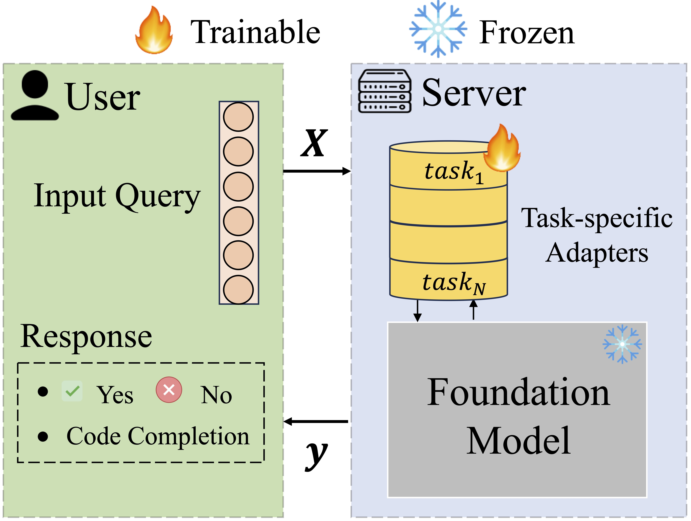

# Prompt Tuning Strikes Back: Customizing Foundation Models with Low-Rank Prompt Adaptation

This repository contains the official implementation of the paper titled "Prompt Tuning Strikes Back: Customizing Foundation  Models with Low-Rank Prompt Adaptation"

<div style="display: flex; gap: 1px;">
  <figure style="flex: 0 0 30%;">
    
    <figcaption>A schematic illustrating how typical PEFT methods like LoRA achieve personalization of a foundation model for multiple tasks.</figcaption>
  </figure>
  <figure style="flex: 0 0 50%;">
    
    <figcaption>An illustration of LOPA. No task-specific adapters need to be stored on the server.</figcaption>
  </figure>
</div>

---

## Installing Dependencies
> To set up the project dependencies, you have two options:

### Option 1: Using pip
```sh
pip install -r requirements.txt
```

### Option 2: Using docker
Alternatively, you can use a Docker image with pre-installed dependencies.
```sh
docker pull aj0509/prog_synth:latest
```

---

## Training the Model

> To tune the model, you need to run the `tune_foundation_model.py` script. 
  
### Arguments

- `--peft_method`: Specifies the PEFT method to be used.
  - Possible values: `lora`, `pt`, `idpg`, `lopa`

- `--task_name`: Name of the task to be trained on.
  - Possible values: `mbpp`, `cruxeval_input_prediction`, `cruxeval_output_prediction`

- `--model_type`: Specifies the type of foundation model to be used for PEFT.
  - Possible values: `phi-2`, `phi-3`, `codegen-350M`, `codegen2-3_7B`, `deepseek-coder-1.3b-base`, `deepseek-coder-7b-base`, `Meta-Llama-3-8B`

- `--enc_model_type`: Specifies the type of encoder model to be used in lopa or idpg.
  - Possible values: `codebert-base`, `codesage-small`, `codesage-base`, `codesage-large`

- `--num_virtual_tokens`: Length of soft prompt (=m)
  - Example: `5`, `10`, `25`

- `--lp_rank`: Low-Rank for matrix factorization in LOPA (=r)
  - Example: `1`, `2`, `4`

- `--num_epochs`: Number of epochs to train the model.
  - Example: `10`

- `--per_gpu_train_batch_size`: Number of training samples per GPU.
  - Example: `2`

- `--lr`: Learning rate for the optimizer.
  - Example: `0.001` used for PT-based methods, `0.0001` used for LoRA and `0.00001` used for FFT.

- `--log_dir`: Directory to save logs. By default, the current timestamp is used as the name of the directory.
  - Example: `./logs`

### Sample Command

Here is a sample command that tunes `phi-2` for MBPP using LOPA with 10 virtual tokens and rank 1:

```sh
python tune_foundation_model.py --peft_method lopa --task_name mbpp --model_type phi-2 --enc_model_type codesage-small --num_virtual_tokens 10 --lp_rank 1 --num_epochs 10 --per_gpu_train_batch_size 2 --lr 0.001
```

### Using Huggingface Accelerator
For using accelerator. Here is an example command that uses deepspeed-stage2 with accelerate:

```sh
accelerate launch --config_file config_ds_zero_stage2_no_fp16.yaml tune_foundation_model.py
```

Requirements: 
- Setup `.yaml` configuration file for the experiment. Example: [config_ds_zero_stage2_no_fp16.yaml](config_ds_zero_stage2_no_fp16.yaml)
- Provide path to deepspeed-stage2 configuration file in the `.yaml` file. Example: [ds_zero_stage2_no_fp16_config.json](ds_zero_stage2_no_fp16_config.json) 

Use the following link for more details: [Huggingface Accelerator](https://huggingface.co/docs/accelerate/en/basic_tutorials/install)


### Full Fine-Tuning (FFT)
> We provide a separate script for full fine-tuning [tune_fft_baseline.py](tune_fft_baseline.py)

Recommendation: Use Deepspeed-stage3 for FFT training to tune large models.

```sh
deepspeed tune_fft_baseline.py --path_to_ds_config ./zero_stage3_config.json --fp16 True --gradient_accumulation_steps 2
```

Requirements:
- Setup deepspeed configuration file for the experiment. Example: [zero_stage3_config.json](zero_stage3_config.json)

---

## Evaluating and Getting Results

> To evaluate the model, you need to generate predictions using `generate_preds.py` script. 

### Sample Command

Here is a sample command that generates predictions for `phi-2` tuned on MBPP using LOPA with 10 virtual tokens and rank 1:

```sh
accelerate launch generate_preds.py --peft_method lopa --task_name mbpp --model_type phi-2 --enc_model_type codesage-small --num_virtual_tokens 10 --lp_rank 1
```

### Additional Arguments Needed

Following arguments are needed to load the weights for the peft method.

- `--load_adapter_from`: Path to directory containing the adapter weights for the foundation model. (Used by pt, lora, idpg, lopa)
- `--clf_predictor_path`: Path to the encoder model weights for. (Used by lopa, idpg)
- `--load_base_from_path`: Path to the base model weights. (Used by fft for un-sharded checkpoints)
- `--sharded_checkpoint_dir`: Path to the sharded checkpoint directory. (Used by fft)

### Post-Processing

> Predictions of foundation models need to be post-processed before evaluation.

To run post-processing for MBPP, use the following command:
```sh
python postprocess_mbpp_preds.py --path "$path_to_mbxp_solutions_json"
```

To run post-processing for CruxEval-I, use the following command:
```sh
python postprocess_cruxeval_preds.py --path "$path_to_output_raw_json" --mode input
```

The processed predictions will be saved in the same directory as a different file.

### Running Predictions

Requirements:
- Setup the MBXP evaluation suite. Based of [Amazon Science/mxeval](https://github.com/amazon-science/mxeval). `pip install -e mxeval`
- Setup the CruxEval evaluation suite. Based of [Facebook Research/CRUXEval](https://github.com/facebookresearch/cruxeval). `cd cruxeval && pip install -r requirements.txt`

To evaluate predictions for MBPP, use the following command:
```sh
evaluate_functional_correctness "$path_to_mbxp_solutions_post_processed" --problem_file mxeval/mbpp_test_release_v1.jsonl
```

To evaluate predictions for CruxEval-I, use the following command:
```sh
python cruxeval/evaluation/evaluate_generations.py --generations_path "$path_to_output_json" --scored_results_path "$path_to_output_scored_json" --mode input
```

--- 
## Results

We provide the sample results (pass@1) of running different PEFT methods `phi-2` across different tasks. For rest of the results, please refer to the paper.


| Tuning Method | CruxEval-I | CruxEval-O | MBPP  |
|---------------|------------|------------|-------|
| None          | 33.5       | 33.0       | 45.17 |
| FFT           | 40.2       | 37.0       | 55.03 |
| LoRA          | 41.5       | 42.5       | 51.54 |
| PT            | 35.0       | 34.0       | 49.69 |
| IDPG          | 35.0       | 33.0       | 53.29 |
| LOPA          | 43.0       | 37.2       | 52.15 |


---

## Contributing

We welcome contributions to the project. Please raise an issue or submit a pull request.